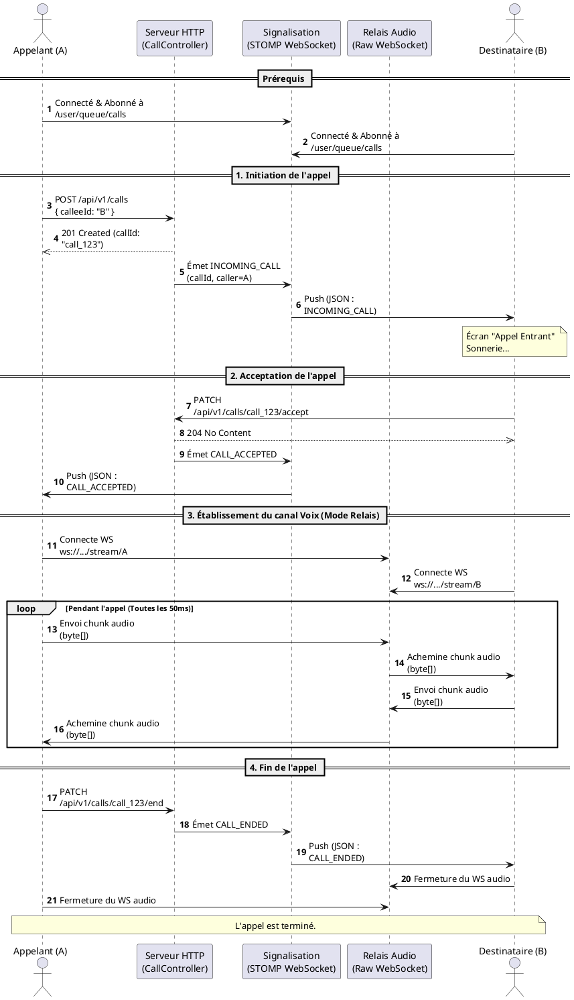

# Documentation du Module Call (Appels Audio)

Ce document décrit le fonctionnement du module `call` (situé dans `com.karibu.ride_app_backend.call`), son architecture, et donne un guide d'intégration complet pour l'équipe Frontend / Mobile.

## 1. Vue d'ensemble de l'Architecture

Le module est construit en suivant la **Clean Architecture** (Ports and Adapters / Architecture Hexagonale) :
- **Domain Layer** : Contient l'entité centrale `Call` (qui est une machine à états : `INITIATED` -> `RINGING` -> `ACCEPTED` -> `IN_PROGRESS` -> `ENDED`).
- **Application Layer** : Contient les cas d'utilisation (Use Cases) d'orchestration.
- **Infrastructure Layer** : Implémente la persistance (PostgreSQL/JPA), un planificateur système (Scheduler pour purger les appels non répondus), et les WebSockets.
- **API Layer** : Expose de manière sécurisée les requêtes HTTP (RestControllers).

---

## 2. Comment le Flux Audio Fonctionne (Sans Twilio)

Pour s'affranchir des services payants tiers (comme Twilio) tout en garantissant une communication rapide, le système utilise deux canaux distincts en parallèle :

### A. Le canal de signalisation (`STOMP` WebSocket)
Il sert à échanger des événements **textuels** (JSON) :
- "Ton téléphone sonne" (`INCOMING_CALL`)
- "L'interlocuteur a décroché" (`CALL_ACCEPTED`)
- "L'interlocuteur a raccroché" (`CALL_ENDED`)
- *Endpoint :* `ws://votre-serveur/ws-notifications` (Canaux `/user/{userId}/queue/calls`).

### B. Le relais audio (`RAW` WebSocket)
Il sert de passe-plat ultra-rapide en RAM (côté serveur) pour transporter la **voix** (sous forme binaire, ex: PCM 16-bit ou Opus).
- *Endpoint :* `ws://votre-serveur/api/v1/calls/{callId}/stream/{userId}`
- Ce canal accepte des `byte[]` et les redistribue à l'autre participant sans jamais toucher au disque ou à la base de données.

---

## 3. Guide d'Exploitation Front-End / Mobile

Voici le cheminement exact à implémenter côté application cliente (Flutter, Kotlin, Swift, React Native).

### Étape 1 : S'abonner aux notifications (Dès le login)
Dès que l'utilisateur ouvre l'application, il doit se connecter au STOMP WebSocket pour écouter si quelqu'un l'appelle.
- Connecter à : `ws://serveur/ws-notifications` (avec le header `Authorization: Bearer <TKN>`).
- S'abonner à : `/user/queue/calls`

### Étape 2 : L'Appelant "A" initie l'appel
L'Appelant fait une requête HTTP POST pour démarrer la sonnerie :
```http
POST /api/v1/calls
Authorization: Bearer <TOKEN_APPELANT>
Content-Type: application/json

{
  "calleeId": "UUID_DU_DESTINATAIRE",
  "callType": "AUDIO"
}
```
*Le serveur retourne un `callId` (l'identifiant de la session).*

### Étape 3 : Le Destinataire "B" reçoit la sonnerie
Le serveur prévient le destinataire via le socket STOMP (sur `/user/queue/calls`).
L'application du destinataire reçoit un payload JSON de ce type :
```json
{
  "type": "INCOMING_CALL",
  "callId": "1234-abcd-...",
  "callerId": "UUID_DE_L_APPELANT"
}
```
=> L'application cliente affiche l'écran de réception d'appel ("Accepter" / "Refuser").

### Étape 4 : Le Destinataire "B" accepte
Le destinataire appuie sur "Accepter" :
```http
PATCH /api/v1/calls/{callId}/accept
Authorization: Bearer <TOKEN_DESTINATAIRE>
```
Dès ce moment, **le Backend avertit l'Appelant ("A")** sur STOMP avec l'événement `CALL_ACCEPTED`.

### Étape 5 : L'échange de Voix (Stream Audio 🎤)
Les deux applications mobiles (A et B) se connectent **immédiatement** au WebSocket raw (binaire) :
`ws://serveur/api/v1/calls/{callId}/stream/{mon_propre_userId}`

**Mécanique du micro :**
1. L'app mobile capture le micro (par "chunks" de 20ms à 50ms).
2. Elle envoie ces bytes bruts (`byte[]`) sur le WebSocket.
3. Le serveur backend route instantanément ces bytes vers le socket de l'autre téléphone.
4. L'app mobile d'en face réceptionne les bytes et les joue dans le haut-parleur.

### Étape 6 : Raccrocher
L'un des utilisateurs appuie sur "Raccrocher" :
```http
PATCH /api/v1/calls/{callId}/end
Authorization: Bearer <TOKEN_QUELCONQUE>
{ "reason" : "NORMAL" }
```
- Le backend clôture l'appel en BDD.
- Envoie un signal STOMP `CALL_ENDED` aux téléphones.
- Les téléphones coupent la capture du micro et ferment les WebSockets (`Raw` et arrêt de l'écran d'appel).

---

## 4. Diagramme de Séquence (PlantUML)

Voici le diagramme UML décrivant ce cheminement.


